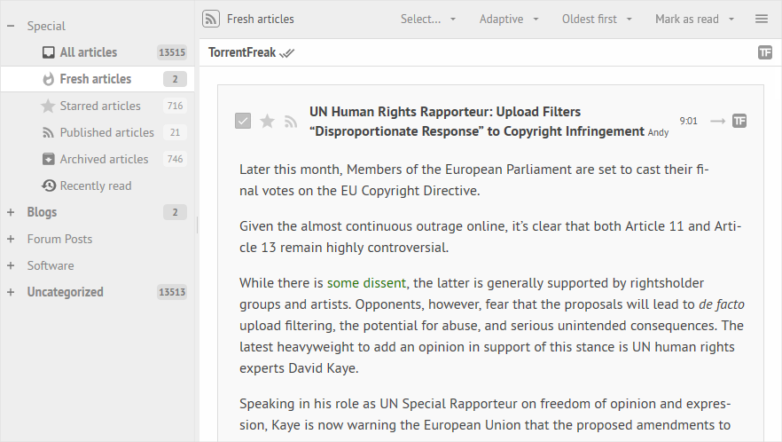

# FeedMei Theme + Plugins for Tiny Tiny RSS
A clean and minimal theme for [Tiny Tiny RSS](https://tt-rss.org), loosely inspired by Feedly. Built by making the minimal amount of changes to the default theme.

This repo also includes a set of plugins ([see details](plugins.local/)). Finally, there's an [update & cleanup script](update_tt-rss.php) to easily update your Tiny Tiny RSS instance to the latest commit.




## Installation
_This theme can only be used in Tiny Tiny RSS v19.2 or later._  
Just copy the contents of `themes.local` to the `themes.local` folder of your Tiny Tiny RSS installation. You can also copy `plugins.local` to your installation for additional functionality (see [README.md](plugins.local/)).

## Customization Tips

### Toggle night mode
If you want to use the menu option "Toggle night mode" for this (or any other custom) theme, instead of just the default theme, be sure to copy over `plugins.local/toggle_night_mode` and enable it in the plugin preferences. This plugin checks if the active custom theme has a `themes.local/[theme]_night.css` variant and enables/disables it. If there's no such file, the plugin will revert to the default behavior (and use the default theme to toggle night mode).

### Maximum width for articles
For optimal reading, the article shouldn't stretch out too far. Add this to `feedmei.css`, or use `feedmei+.css`, which includes more of my personal preferences:
```
div.cdm.expanded {
	width: calc(100% - 72px);
	max-width: 960px;
	margin: 21px auto;
}

.content {
	max-width: 50em;
	margin: 0 auto;
}
```

### Align article top
In combined mode, put some space between the article and the header when jumping to previous/next article with hotkeys. In `rss/js/Article.js` replace:
```
				ctr.scrollTop = e.offsetTop;
```
with
```
				ctr.scrollTop = e.offsetTop - (App.getInitParam("cdm_expanded") ? 21 : 0);
```